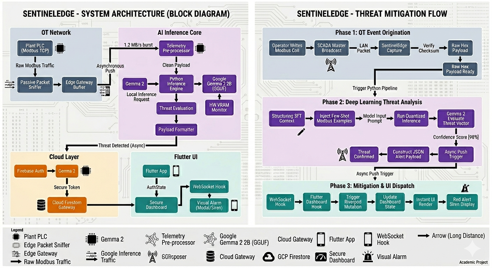

# Sentinel-Edge: SCADA Telemetry Pipeline & AI Dashboard

This repository contains the full architecture for an advanced Industrial IoT cybersecurity evaluation pipeline. It combines an edge-deployed Modbus parsing / AI inference script (using local Large Language Models for classification) with a real-time reactive Flutter Dashboard that visually monitors ICS commands and enforces Role-Based Access Control (RBAC).

## 🏗️ Architectural Overview

## 📁 Repository Structure

- `SentinelEdge_Pipeline/`: Python codebase simulating the embedded SCADA edge parser. Extracts mock Modbus data from the dataset, evaluates it using a local GGML/GGUF model via `llama.cpp`, and uploads structured results to Firebase via the Admin SDK.
- `SentinelEdge_Dashboard/`: The Flutter frontend (Dart/Google UI). Acts as the primary operations dashboard with color-coded Threat parsing, live Modbus graphs (via fl_chart), and strict user-registration boundaries.
- `Colab_Notebooks/`: Contains the Jupyter notebooks utilized for fine-tuning the base `Gemma-2-2b-it` model on the custom SCADA dataset.

## 🚀 Setup & Execution Guide

### 1. Flutter Dashboard Setup
The Dashboard enforces strict RBAC (Role-Based Access Control). Newly generated accounts are immediately blocked until an Admin approves them.
1. Download Flutter SDK and resolve dependencies: `flutter pub get`
2. Navigate to `lib/firebase_options.dart` and enter your Firebase web configurations.
3. Run the application: `flutter run -d web`
4. Register a new account.
5. Go to your Firebase Cloud Firestore Console, find the newly generated user in the `users` collection, and manually change their fields to `role: 'admin'` and `status: 'approved'`. Refersh the Flutter app and login!

### 2. Edge Python Pipeline Setup
This service acts as the physical layer data injector.
1. Go to your Firebase project and generate a new Service Account Private Key.
2. Rename the json to `service-account.json` and place it in the pipeline directory.
3. Install dependencies: `pip install firebase-admin`
4. Run the simulation loop: `python firebase_upload_service.py --continuous --delay 3` 

## 🛡️ License & Disclaimers
This repository is heavily tailored around educational IIoT research. Production deployments must integrate strict firewall layers around the `service-account.json`.
